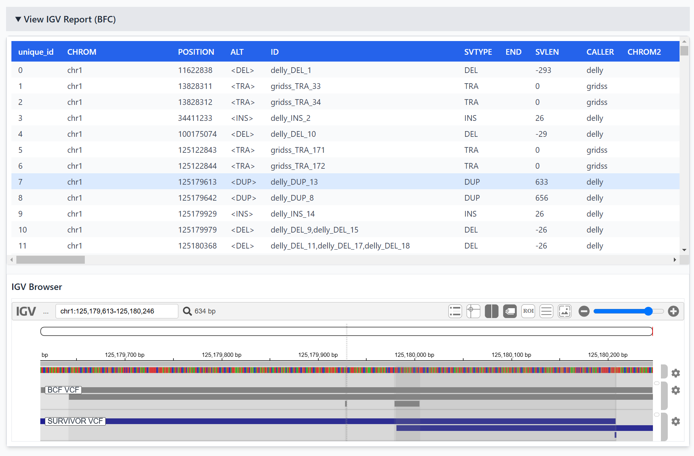

# Varify

**Variant File Report Generator**
A Python-based tool to generate rich, interactive HTML reports from structural variant (SV) VCF files, such as those produced by [bcftools](http://samtools.github.io/bcftools/) and [SURVIVOR](https://github.com/fritzsedlazeck/SURVIVOR).

[](https://www.gnu.org/licenses/gpl-3.0)


> **⚠️ v3.0.0 Major Release**: This version includes significant architectural changes. JavaScript assets must be built with `npm run build:report` before packaging. See [BUILD.md](BUILD.md) for details.

---

## ✨ Features

- 📊 **Interactive ECharts visualizations** for SV types, lengths, quality, and caller combinations
- 🗄️ **Client-side IndexedDB storage** for fast filtering and querying of large variant datasets
- 📈 Automatically generates a **self-contained HTML report** including:
  - BCFtools summary plots and tables
  - SURVIVOR summary plots and tables
  - IGV.js genome browser integration (if BAMs are provided)
- ⚡ **High-performance AG-Grid tables** with virtual scrolling and advanced filtering
- 🎨 Modern responsive UI with **Tailwind CSS v4** and **Alpine.js**
- 🔍 Real-time search and filter across all variant fields
- 📊 Caller overlap analysis and quality distributions
- 🧬 Chromosome-level heatmaps and SV type breakdowns
- 🚀 No server required - runs entirely in the browser
- 🧪 Profile-aware output for pipeline integration (e.g. `--profile nextflow`)

---

## 🧰 Requirements

### Python Dependencies
- Python 3.10+
- pandas, numpy, pysam, vcfpy (auto-installed)

### JavaScript Dependencies (for building)
- Node.js 18+
- npm (comes with Node.js)

### Installation

**Option 1: Install from source**
```bash
# Install Python dependencies
pip install -r requirements.txt

# Build JavaScript assets (required for v3.0.0+)
npm install
npm run build:report

# Install package
pip install .
```

**Option 2: Development mode**
```bash
pip install -r requirements.txt -r requirements-dev.txt
npm install
npm run build:report
pip install -e .
```

---

## 🚀 Usage

### After Installation
```bash
varify \
  --output-dir results/ \
  --bcf-vcf-file data/bcftools_concat.vcf.gz \
  --survivor-vcf-file data/survivor_merge.vcf \
  --fasta-file data/reference.fna \
  --bcf-stats-file data/bcftools.stats \
  --survivor-stats-file data/survivor.stats \
  --report-file index.html
```

### From Source (Without Installation)
```bash
# Activate virtual environment
source venv/bin/activate

# Run as module
python -m src.varify.varify \
  --output-dir /path/to/output/ \
  --bcf-vcf-file data/bcftools_concat.vcf.gz \
  --survivor-vcf-file data/survivor_merge.vcf \
  --fasta-file data/GCF_000146045.fna \
  --bcf-stats-file data/bcftools.stats \
  --survivor-stats-file data/survivor.stats \
  --report-file "index.html"
```

---

### Required Inputs

| Argument | Description |
|----------|-------------|
| `--output-dir` | Directory to write plots and reports |
| `--bcf-vcf-file` | VCF file from BCFtools merge |
| `--survivor-vcf-file` | VCF file from SURVIVOR merge |
| `--bcf-stats-file` | Output from `bcftools stats` on the BCF VCF |
| `--survivor-stats-file` | Tabular SURVIVOR summary file (e.g. SV types per size bin) |
| `--fasta-file` | Reference genome used for alignment |
| `--report-file` | Path to output HTML file |

---

### Optional Inputs

| Argument | Description |
|----------|-------------|
| `--sample-vcf-files` | List of individual sample VCFs (optional, not yet used) |
| `--bam-files` | One or more BAM files for IGV iframe views |
| `--profile` | Pipeline or execution profile label (e.g. "default", "nextflow") |

---

## 📂 Output

- 📄 `varify_report.html`: Self-contained interactive HTML report (~3.5 MB)
  - Embedded JavaScript bundle with all functionality
  - No external dependencies required
  - Works offline in any modern browser
- 🗄️ **IndexedDB Storage**: Variants stored client-side for instant filtering
- 📊 **Interactive Visualizations**: ECharts-powered plots with zoom, pan, and selection
- 🧬 **Genome Browser**: IGV.js integration with BAM track support
- ⚡ **Fast Tables**: AG-Grid with virtual scrolling for thousands of variants

---

## 🖼️ Example Screenshots

| Summary | Interactive Plot | IGV Section |
|--------|------------------|-------------|
|  |  |  |

---

## 🧪 Architecture

Varify is built with a modern, modular architecture:

### Python Backend
- `src/varify/varify.py`: Main CLI entry point and report generator
- `src/varify/cli/`: Command-line interface components
- `src/varify/core/`: Core parsing and processing logic
- `src/varify/reporting/`: HTML report generation
- Generates a single HTML file with embedded assets

### JavaScript Frontend (ES6 Modules)
- **Components**: UI components (tables, charts, file upload, IGV integration)
  - `VariantTableAGGrid`: High-performance data tables
  - `VarifyPlots`: ECharts visualization engine
  - `FileUpload`: IndexedDB file management
  - `IGVIntegration`: Genome browser integration
- **Core**: Parsers, storage, and query engine
  - `VCFParser`: VCF file parsing
  - `IndexedDBManager`: Client-side database
  - `VariantHandlers`: BCF and SURVIVOR format handling
- **Services**: Metadata analysis and field detection
- **Utils**: Statistics, validation, and color schemes
- **Config**: Display settings, VCF field definitions
- **Build**: esbuild bundler with PostCSS/Tailwind CSS processing

---

## 🧪 Development & Testing

### JavaScript Development

The frontend is built with modern JavaScript tooling:

```bash
# Install dependencies
npm install

# Build JavaScript bundle (esbuild)
npm run build

# Build report with CSS processing
npm run build:report

# Build everything
npm run build:all

# Development mode (watch for changes)
npm run dev

# Format code (Prettier)
npm run format

# Check formatting
npm run format:check
```

**Key Dependencies:**
- **esbuild**: Ultra-fast JavaScript bundler
- **Tailwind CSS v4**: Utility-first CSS framework
- **AG-Grid Community**: High-performance data tables
- **ECharts**: Interactive visualization library
- **IGV.js**: Genome browser
- **Alpine.js**: Reactive UI framework
- **Vitest**: Fast unit testing framework
- **Prettier**: Code formatter

---

### Frontend Testing

Varify includes a comprehensive test suite for the JavaScript frontend with **575 tests** covering core functionality:

```bash
# Run all tests
npm test -- --run

# Run tests in watch mode
npm test

# Run specific test file
npm test -- tests/js/core/query/VariantFilter.test.js

# View coverage report
npm test -- --coverage
```

**Test Coverage: 44% (18/41 source files)**

#### Test Files
- ✅ Variant Handlers (BCF, SURVIVOR, Registry)
- ✅ VCF Parsers (Variant, Genotype, Header)
- ✅ Query & Filtering (VariantFilter)
- ✅ Storage & Flattening (VariantFlattener, CallerDataProcessor)
- ✅ Services (MetadataService)
- ✅ Components (AG-Grid Table, Export Handlers)
- ✅ Utilities (StatisticsUtils)

See [CLAUDE_SESSION_SUMMARY.md](CLAUDE_SESSION_SUMMARY.md) for detailed test documentation.

---

## 📜 License

GPL-3.0-or-later.  
Created with ❤️ by **Luppo** for structural variant exploration.

---

Contributions welcome! If you'd like to add filters, annotation support, pipeline integration, or new visualizations, open a PR!

